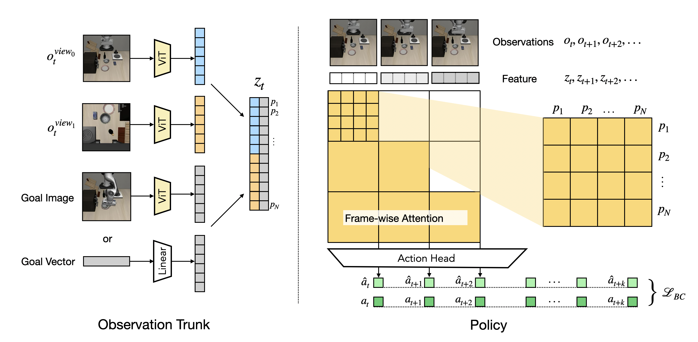

# Patch Policy: Efficient Embodied Control via Dense Visual Representations

[[Project Website]](https://patch-policy.github.io/) [[Paper]](https://arxiv.org/abs/2607.18236v1)

[Gaoyue Zhou](https://gaoyuezhou.github.io/), [Zichen Jeff Cui](https://jeffcui.com/), [Ada Langford](https://www.linkedin.com/in/ada-langford-231883332/), [Bowen Tan](https://bowen-tan.com/), [Yann LeCun](http://yann.lecun.com/) and [Lerrel Pinto](https://www.lerrelpinto.com/), New York University, Meta AI, AMI Labs

https://github.com/user-attachments/assets/3de8fc0d-9411-41f3-84c3-9e79b899e144




Code will be released soon. Stay tuned!

## Citation

If you find our work useful, please consider citing:

```bibtex
@misc{zhou2026patchpolicyefficientembodied,
      title={Patch Policy: Efficient Embodied Control via Dense Visual Representations}, 
      author={Gaoyue Zhou and Zichen Jeff Cui and Ada Langford and Bowen Tan and Yann LeCun and Lerrel Pinto},
      year={2026},
      eprint={2607.18236},
      archivePrefix={arXiv},
      primaryClass={cs.RO},
      url={https://arxiv.org/abs/2607.18236}, 
}
```
